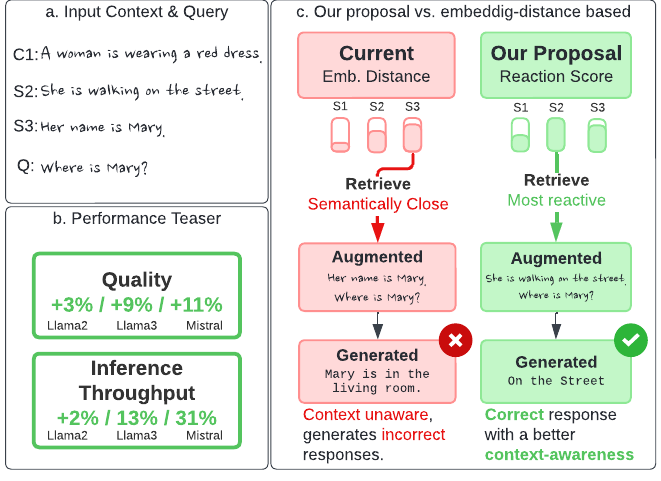
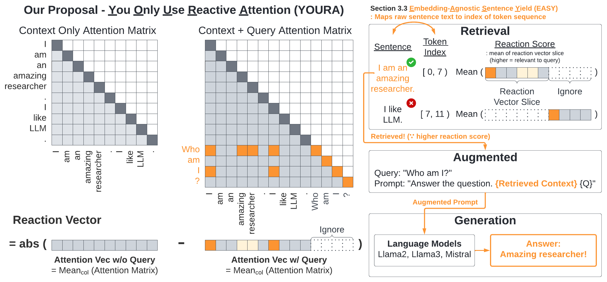

# *Y*ou *O*nly *U*se *R*eactive *A*ttention slice for long context retrieval

YOURA is a novel attention-based retrieval approach.

## About

Instead of using embedding-based approach, which often falls short (more detail on paper), YOURA uses a heuristic called "reaction score" for long context retrieval.



YOURA measures the "reactiveness" of a sentence with respect to query by measuring how the attention score changes in the presence of a query.



Check our paper for more detail.

## Usage

For running experiments, run following scripts in order.

```bash
bash scripts/1_data.sh
bash scripts/2_easy.sh
bash scripts/3_youra.sh
```

Note that the quality numbers generated in the paper uses HuggingFace transformers with eager attention implementatino while the numbers generated by the script above (`results/table*.csv`) are generated from vllm using flash attention.
See files within the auto-generated folder (e.g., `EXPERIMENT_DATE/results.csv`) for HuggingFace transformer generated results.
The exact numbers may vary but the general trend holds (Youra ~= Trunc).

## Machine Used

We used a single server with two Intel(R) Xeon(R) Gold 5416S, 512G DRAM, and a single NVIDIA H100-80G.

## Bibliography

```
Place holder
```